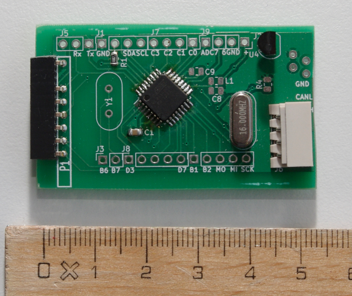
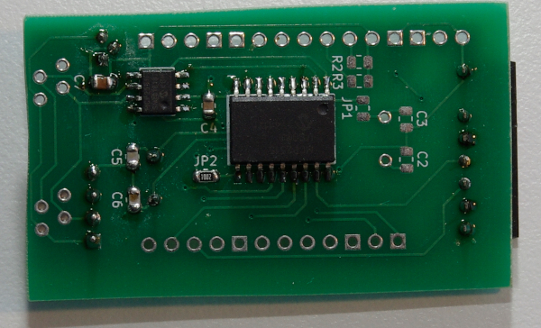

# Generic AVR CAN board

This project is a generic [AVR](https://en.wikipedia.org/wiki/AVR_microcontrollers) board with [CAN](https://en.wikipedia.org/wiki/CAN_bus) onboard.
It is designed to be a small-size (55mm x 30mm) versatile board for CAN applications.

The main microcontroller is an ATmega168P or similar (any TQFP32 ATmega can be soldered on the board), for CAN the MCP2515 controller and MCP2551 transceiver are used.
All free pins are routed to the side pin rows (2.54mm spacing), similar to the popular Arduinos.
A voltage regulator (LP2950) is included to use a wide range of voltage sources, typically 12V or 24V supply voltage goes along with the CAN bus so you can spare an additional power supply.
Basic components are SMD 0805 size, use zero ohm 0805 resistors as bridges.

To save cost and PCB space, there is no onboard programmer; an external programmer must be plugged to flash the MCU.
The board has a connector to program (P1) which fits the [mysmartUSB MK2](https://shop.myavr.com/systemboards%20and%20programmer/mySmartUSB%20MK2%20(Programmer%20und%20Bridge).htm?sp=article.sp.php&artID=200179) but any programmer can be wired.

## Configurable features

The board can be configured in separate ways by soldering or not certain bridges or resistors.

* CAN connector can be either two RJ11 or a Molex SPOX
* MCU clock source:
    - internal clock
    - separate crystal (solder crystal and C2 and C3)
    - clock from the MCP2515 (solder a bridge to JP1 and program the MCP2515 accordingly)
* Possibility of using power-safe mode of the MCP2551: solder JP2 _instead of_ R4 (and program the MCP2515 accordingly)
* Select the edge steepness of the CAN signal by adjusting the value of R4 or JP2 (see [MCP2551 datasheet](https://ww1.microchip.com/downloads/en/DeviceDoc/20001667G.pdf))
* I2C pullup resistors: Solder R2 and R3
* Analogue input circuit if required (L1, C8, C9)

## Cape

A template for a cape (PCB which can be plugged onto the controller board as an extension) is included. Add your own circuit to the cape template.

## Firmware

A few tips:

* The SS pin (B2) of the ATmega _must_ be configured as an output, otherwise the SPI communication with the MCP2515 doesn't work.
* As library for the CAN controller you can use, for example, [avr-canlib](https://github.com/klaussnd/avr-can-lib) or [modm](https://modm.io/).

## License

The circuits are licensed under the terms of the [GNU Affero General Public License](https://www.gnu.org/licenses/agpl-3.0.en.html).
